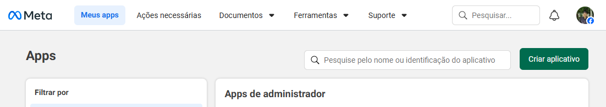
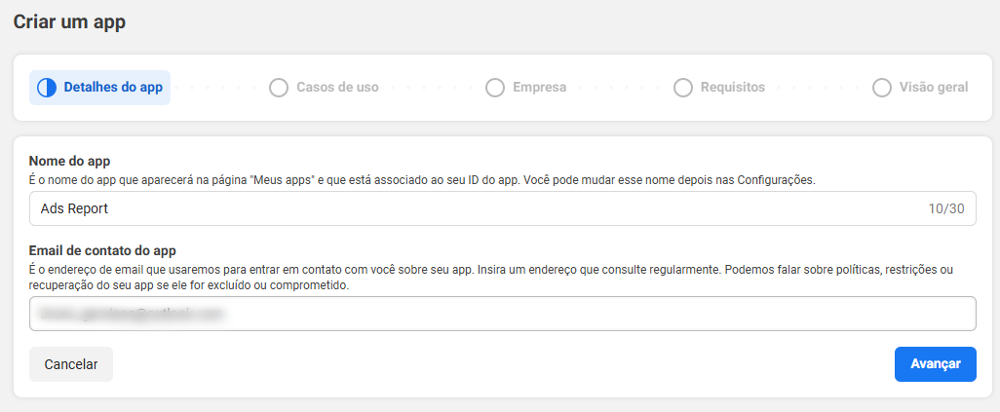
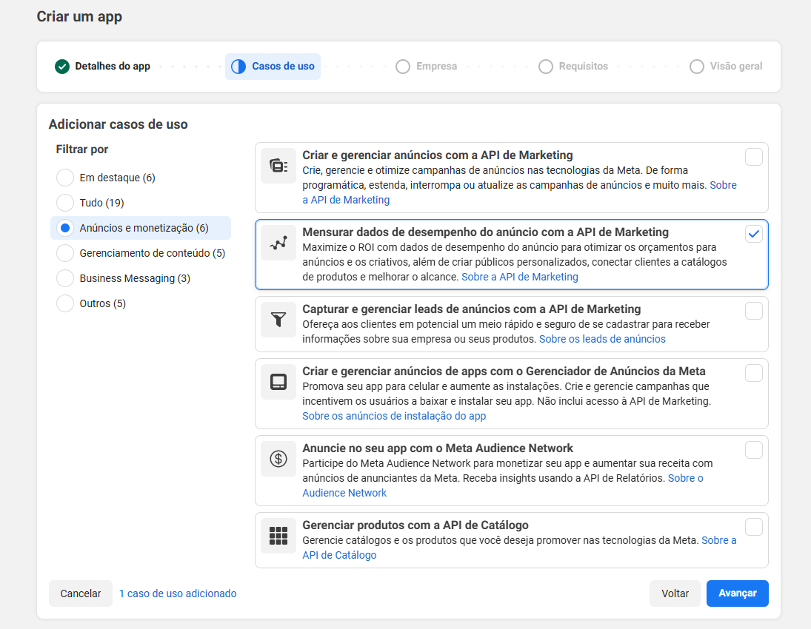
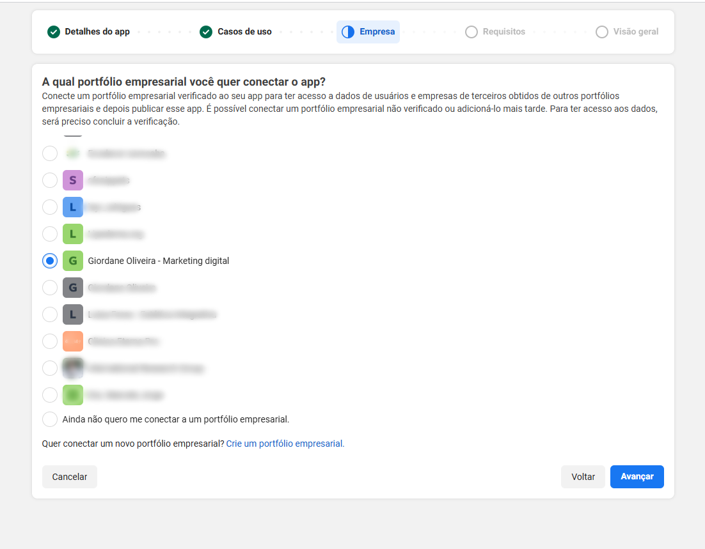
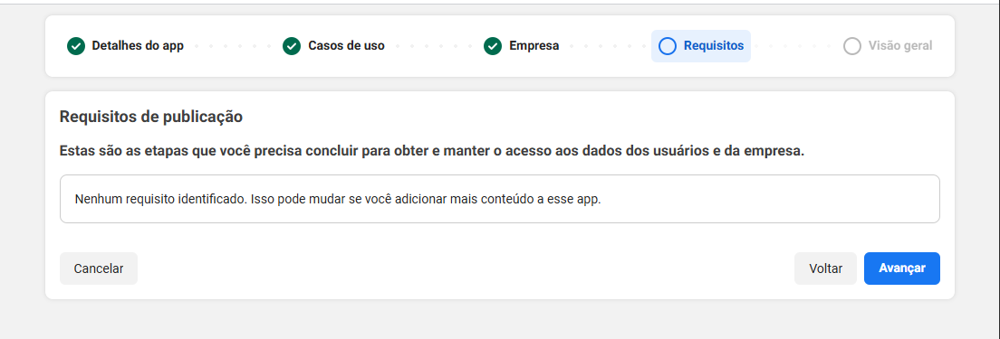
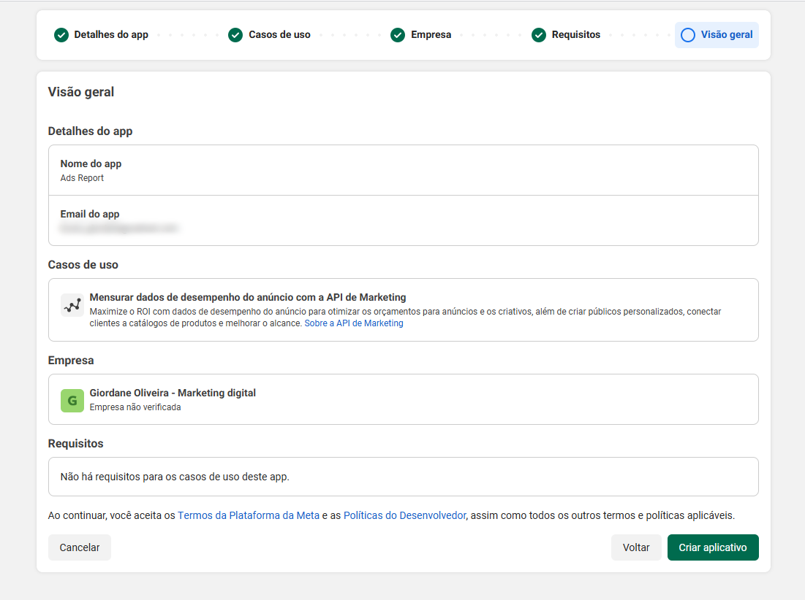

# Configurando as credenciais do Facebook

Este guia mostra como criar um app no Facebook for Developers e gerar um token de acesso de longa duração (90 dias). O processo leva cerca de 5 minutos e é totalmente gratuito.

> 💡 O AdsReport opera em **modo de desenvolvimento da Marketing API**. Você usa seu próprio app para ler seus próprios dados de anúncios. Não há aprovação da Meta, nem custo, nem App Review necessário.

---

## Pré-requisitos

- Uma conta no Facebook com acesso às contas de anúncio que você quer monitorar
- Acesso a [developers.facebook.com](https://developers.facebook.com)

---

## Passo 1 — Criar o app

Acesse [developers.facebook.com/apps](https://developers.facebook.com/apps) e clique em **Criar aplicativo**.

Na tela seguinte, selecione **Outros** como caso de uso e clique em **Avançar**.

Escolha o tipo **Empresa** e clique em **Avançar**.

Preencha o nome do app (ex.: `AdsReport Local`) e o e-mail de contato. O campo "Conta Business" é opcional. Clique em **Criar app**.

O Facebook pode pedir para você confirmar a senha da sua conta. Após confirmar, o painel do app será aberto.

No painel, localize o produto **Marketing API** e clique em **Configurar**.

---

## Passo 2 — Obter o App ID e o App Secret

No menu lateral, vá em **Configurações → Básico**.

Copie o **ID do Aplicativo** e clique em **Mostrar** ao lado do **Chave Secreta do Aplicativo** para copiá-la também.

Guarde os dois valores — você vai precisar deles no onboarding do AdsReport.

---

## Passo 3 — Gerar o Access Token

Acesse o [Explorador da Graph API](https://developers.facebook.com/tools/explorer/).

No topo direito, confirme que o app selecionado é o que você criou.

### Adicionar as permissões necessárias

Clique no campo de permissões e adicione cada uma das seguintes:

| Permissão | Para que serve |
|---|---|
| `ads_read` | Ler dados de campanhas e anúncios |
| `ads_management` | Ler metadados das contas |
| `read_insights` | Acessar os Insights de performance |
| `business_management` | Listar contas de anúncio da Business |
| `pages_read_engagement` | Informações de páginas vinculadas |
| `pages_show_list` | Listar páginas do usuário |

### Gerar o token

Clique em **Gerar token de acesso**.

O Facebook vai abrir um pop-up pedindo para você escolher quais Páginas e Contas Business receberão acesso. Marque **todas** ou apenas as que você usa no AdsReport, e confirme.

O token gerado aparece no campo **Token de acesso**. Copie-o.

> ⚠️ Este token dura **1–2 horas**. Continue para o Passo 4 para estendê-lo para **90 dias** antes de usar no AdsReport.

---

## Passo 4 — Estender o token para 90 dias

Acesse o [Depurador de Token de Acesso](https://developers.facebook.com/tools/debug/accesstoken/).

Cole o token copiado no campo e clique em **Depurar**.

A página vai mostrar as informações do token. Role até o final e clique em **Estender token de acesso**.

Um novo token será gerado com validade de **90 dias**. Copie esse novo token — ele é o que você vai usar no AdsReport.

> 💡 Quando o token expirar (após ~90 dias), você receberá um erro de sincronização no AdsReport. Repita o Passo 3 e o Passo 4 e atualize o token em **Configurações → Facebook**.

---

## Passo 5 — Inserir as credenciais no AdsReport

Durante o onboarding (Passo 3 do wizard), preencha:

| Campo | Valor |
|---|---|
| **App ID** | ID do Aplicativo (Configurações → Básico) |
| **App Secret** | Chave Secreta do Aplicativo (Configurações → Básico) |
| **Access Token** | Token de 90 dias gerado no Passo 4 |

Clique em **Testar conexão**. O AdsReport vai verificar as credenciais e listar as contas de anúncio disponíveis.

---

## Solução de problemas

**"Token de OAuth inválido" / "Invalid OAuth access token"**
O token expirou ou foi copiado incorretamente. Repita os Passos 3 e 4.

**"Nenhuma conta de anúncio encontrada"**
Seu usuário do Facebook não é admin nem analista de nenhuma conta de anúncio. Peça ao administrador da conta para adicionar você com o papel de **Analista**.

**"Permissão negada" / `ads_read` ausente**
Você não marcou todas as permissões no Explorador. Repita o Passo 3 adicionando as permissões da lista.

**"App não está no modo correto"**
Confirme que o app está em **Modo de desenvolvimento** (barra superior do painel mostra "Desenvolvimento").
